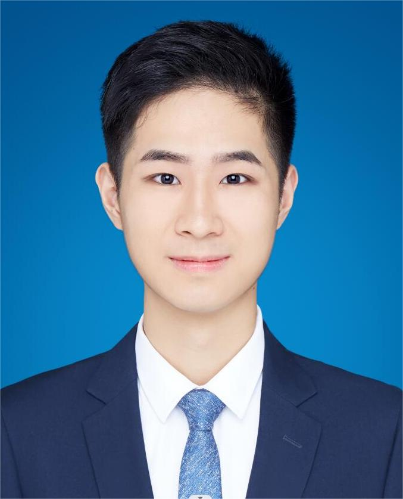

# 自我介绍

华中师范大学计算机学院2020级计算机科学与技术（基地班）学生

# 项目经验

《基于机器学习的乡村污染物精准预测可视化模型》

《为你而语——基于计算机视觉技术的国家通用手语公益教育项目》

《无人机技术在现代农村农业发展中的使用现状及技术推广前景探究》

《“抗疫助学、科创未来”线上义教科普项目》

《E人E田——基于鸿蒙系统的智慧助农项目》

《促“农”抗“疫”——农腾无人机AI数字化公益助农抗疫系统》

《数据库——高校的学籍管理系统》

《人工智能程序设计——教学辅助系统》

# 获奖

2021年05月，获评院级“优秀共青团员”称号

2021年09月，获评2021年校级“三好学生”

2021年09月，获评计算机学院“志愿服务积极分子”称号

2021年10月，获评博雅丹桂奖学金、华为二等奖学金、集体奖学金等五项奖学金

2021年11月，获评华中师范大学“优秀志愿者”称号

2021年12月，荣获第十三届全国大学生数学竞赛（非数学类）二等奖

2021年12月，荣获第十届湖北省大学生数学竞赛（非数学类）二等奖

2021年12月，获评校级“暑期社会实践先进个人”

2022年04月，获评校级“优秀共青团干部”称号

2022年05月，获评计算机学院“优秀部长”称号

2022年06月，获华中师范大学第八届“互联网+”大学生创新创业大赛铜奖

2022年06月，获湖北省第十二届“挑战杯·中国银行”大学生创业计划竞赛金奖

2022年09月，获评2022年校级“三好学生”

2022年10月，获华为一等奖学金、博雅银桂奖学金等四项奖学金

2022年11月，获2022年华中师范大学 E-stage 移动应用创新创意设计大赛优秀奖

2022年11月，获华中师范大学第十五届“挑战杯”课外学术科技作品竞赛二等奖

2022年12月，获评华中师范大学“优秀志愿者”称号

2022年12月，获华中师范大学“桂苑之歌”公益爱心奖学金

2023年01月，荣获第十四届全国大学生数学竞赛（非数学类）三等奖

2023年01月，荣获第十一届湖北省大学生数学竞赛（非数学类）三等奖

2023年03月，获国家留学基金委（CSC）公派留学资格

# 掌握技能

语言技能：英语CET6

专业技能：熟悉掌握C、C++、Python，精通人工智能程序设计、机器学习、深度学习、模式识别、计算机视觉、自然语言处理、大数据、数据结构、数据库原理、离散数学、概率与数理统计、线性代数、高等数学等专业课程与技能

软件技能：熟练使用WPS办公软件，精通数据库

学术认证：华为技术有限公司“Kunpeng-Developer HCIP”认证

